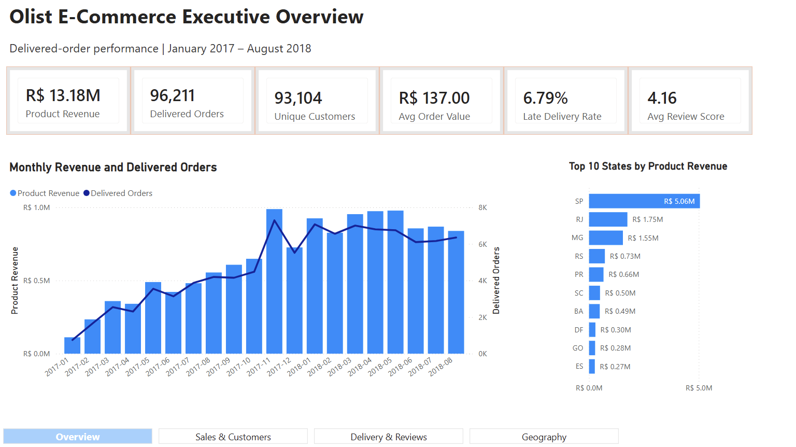
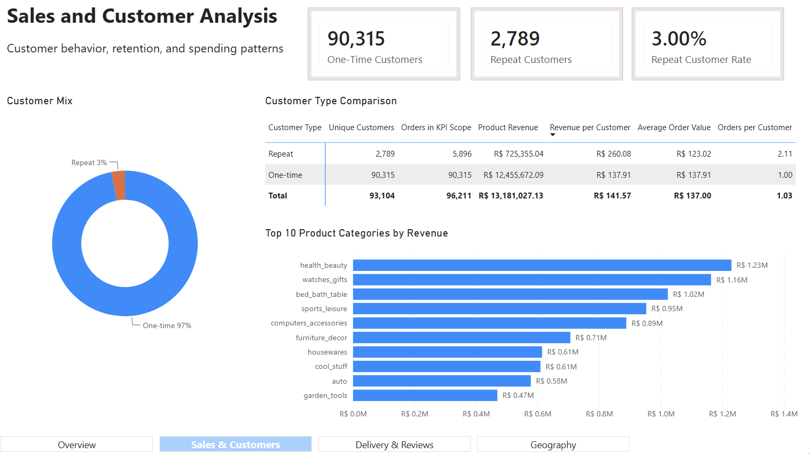
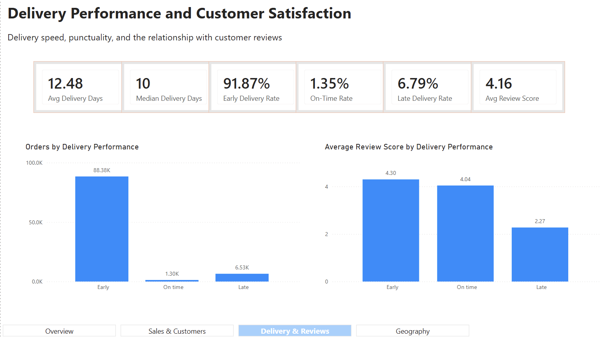
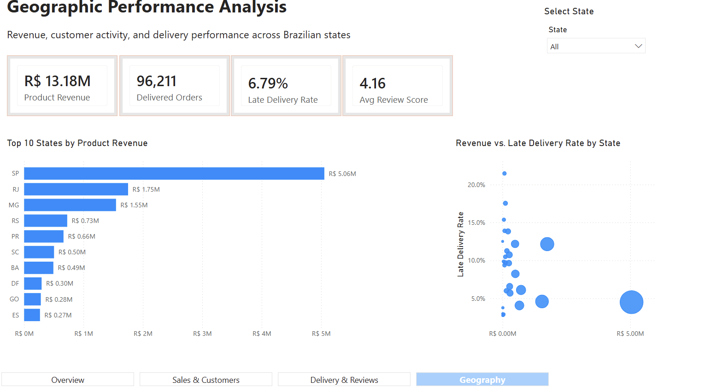
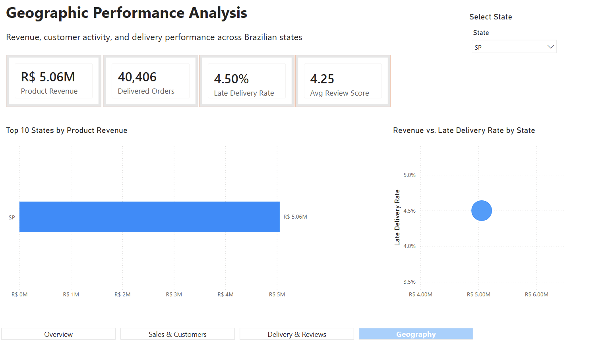
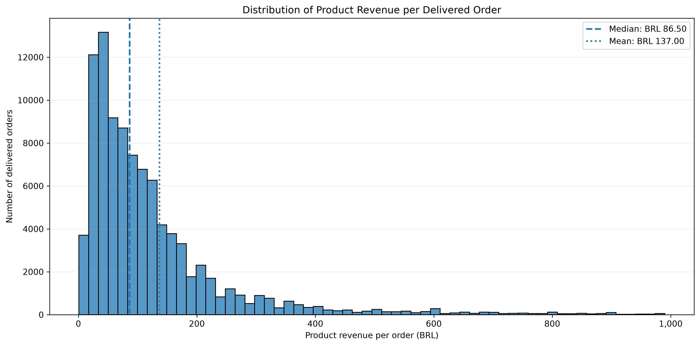
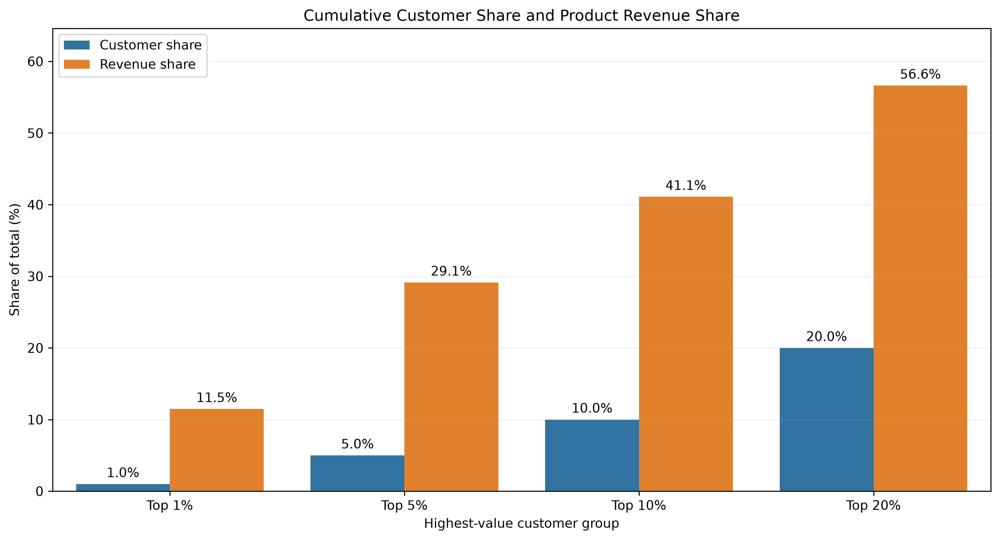
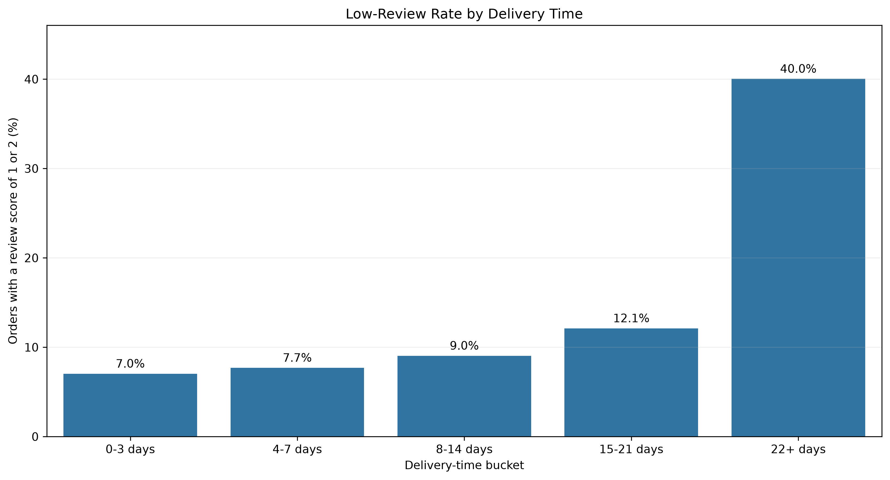
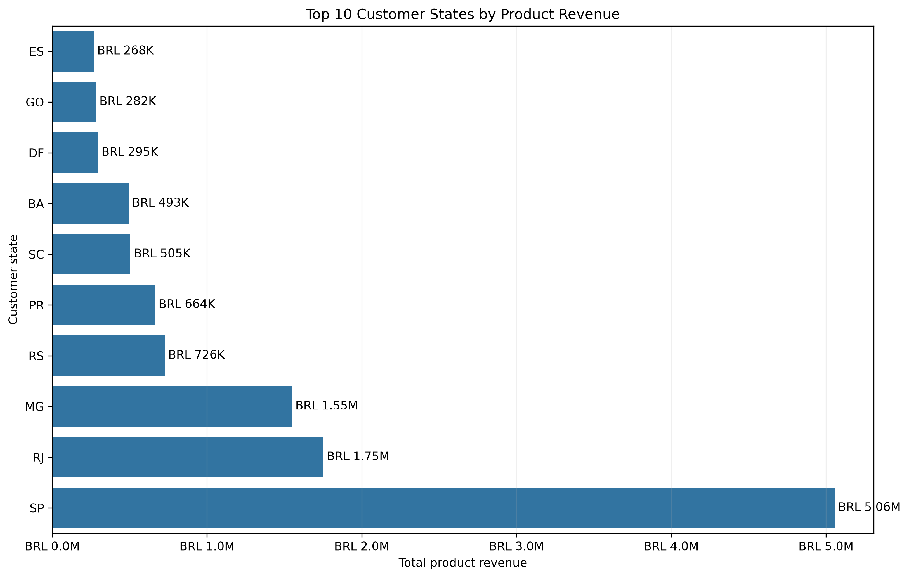
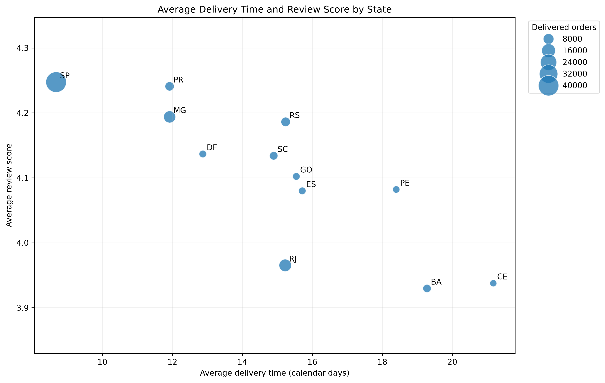

# Brazilian E-Commerce Analysis | Olist Dataset

An end-to-end Data Analyst portfolio project using **PostgreSQL, SQL, Python, pandas, statistical analysis, data visualisation, and Power BI** to evaluate sales performance, customer behaviour, delivery performance, customer satisfaction, and geographic trends.

The project is based on the Brazilian E-Commerce Public Dataset by Olist.

## Project Status

| Project stage | Status |
|---|---|
| PostgreSQL database setup | Complete |
| SQL data validation and analysis | Complete |
| Python exploratory and statistical analysis | Complete |
| Power BI dashboard | Complete |

**Main analysis notebook:** [`notebooks/01_ecommerce_analysis.ipynb`](notebooks/01_ecommerce_analysis.ipynb)

## Business Objective

The purpose of this project is to simulate a real-world e-commerce analysis and answer the following business questions:

- How much revenue did delivered orders generate?
- What does the order-value distribution reveal about customer spending?
- How important are repeat customers?
- How concentrated is revenue among high-value customers?
- How does delivery performance relate to customer review scores?
- Which customer states generate the most orders and revenue?
- Which operational issues represent the greatest customer-experience risk?

## Dataset and Analytical Scope

**Dataset:** Brazilian E-Commerce Public Dataset by Olist

The dataset contains information about:

- orders
- customers
- order items
- products
- sellers
- payments
- customer reviews
- product categories
- customer and seller locations

### Primary reporting rules

- Reporting period: **1 January 2017 to 31 August 2018**
- Primary KPIs include **delivered orders only**
- Product revenue excludes freight unless explicitly stated
- Review records are aggregated to one result per order
- Customer behaviour is analysed using `customer_unique_id`
- Delivery duration is measured in calendar days

## Tools and Skills Demonstrated

- **PostgreSQL** — database schema, validation, views, joins, aggregations, and business analysis
- **SQL** — data-quality checks, analytical queries, customer segmentation, delivery analysis, and CSV exports
- **Python** — reusable analytical datasets, validation, descriptive statistics, segmentation, and reconciliation
- **pandas and NumPy** — transformation, aggregation, merging, bucketing, and outlier classification
- **Matplotlib and Seaborn** — portfolio-ready data visualisations
- **SciPy** — Pearson and Spearman correlation analysis
- **Jupyter Notebook** — documented and reproducible analytical workflow
- **Git and GitHub** — version control and project documentation
- **Power BI** — Power Query transformations, star-schema data modelling, DAX measures, interactive dashboards, slicers, tooltips, and page navigation

## Project Workflow

### 1. PostgreSQL database setup

- Created the relational database structure
- Imported the Olist CSV files
- Verified row counts and table relationships
- Created reusable clean views

### 2. Data-quality analysis

The project investigated and documented:

- primary-key and duplicate-row behaviour
- table grain and join relationships
- orders without associated order items
- multiple review records for the same order
- missing product categories
- non-unique geolocation prefixes
- missing delivery dates
- customers associated with multiple states
- extreme order values and delivery durations

### 3. SQL analysis

SQL was used to calculate and export:

- delivered-order revenue
- average order value
- monthly sales trends
- order-status distribution
- one-time and repeat-customer behaviour
- review-score distribution
- delivery time versus customer reviews
- customer and geographic summaries

The resulting CSV files are stored in:

```text
outputs/sql_exports/
```

### 4. Python analysis

Python independently rebuilt the main analytical datasets from the raw tables.

The Python results were reconciled with the SQL outputs to confirm that:

- filters were applied consistently
- joins did not duplicate orders
- revenue totals matched
- customer totals matched
- geographic summaries matched
- analytical datasets preserved the intended grain

The notebook finishes with automated reproducibility and integrity checks.

## Power BI Dashboard

The final Power BI report presents the validated SQL and Python results through an
interactive business-intelligence dashboard.

Power BI Desktop was used for:

- Power Query transformations and analytical table preparation
- order-level and item-level fact tables
- reusable customer, product, geography, and date dimensions
- one-to-many, single-direction model relationships
- DAX measures for revenue, customers, delivery, and review performance
- slicers, tooltips, cross-filtering, and page navigation
- reconciliation of dashboard KPIs with the completed SQL and Python analyses

### Data Model

The report uses a star-schema-style analytical model:

- `FactOrders` — one row per order for revenue, customer, delivery, and review KPIs
- `FactOrderItems` — one row per order item for product-category analysis
- `DimCustomer` — customer attributes and one-time/repeat segmentation
- `DimProduct` — product and translated category attributes
- `DimGeography` — one row per Brazilian state
- `DimDate` — calendar attributes used for monthly analysis
- `DeliveryStatus` — disconnected helper table for Early, On time, and Late categories
- `00_Measures` — dedicated table containing the report's DAX measures

The dashboard retains separate order and order-item fact tables so that order-level
KPIs are not duplicated when products are analysed at item grain.

### Dashboard Pages

#### 1. Executive Overview

The overview presents headline KPIs, monthly revenue and delivered-order trends,
and the highest-revenue customer states.



#### 2. Sales and Customer Analysis

This page compares one-time and repeat customers and ranks the ten strongest
product categories by product revenue.



#### 3. Delivery Performance and Customer Satisfaction

This page compares early, on-time, and late deliveries and demonstrates the
relationship between delivery performance and customer review scores.



#### 4. Geographic Performance

This page compares state revenue with late-delivery performance and includes an
interactive state slicer.



#### Interactive State-Filter Example

Selecting São Paulo updates the KPI cards, state ranking, and scatter chart to
show only the selected state's results.



### DAX Measure Groups

The model includes measures for:

- delivered orders and unique customers
- product revenue, freight, and total order value
- average and median order value
- one-time and repeat customers
- repeat-customer rate
- category revenue, orders, and unique customers
- average and median delivery duration
- early, on-time, and late delivery counts and rates
- average review score by delivery status
- geographic revenue and delivery performance

All headline Power BI measures were reconciled with the completed SQL and Python
results before the dashboard pages were created.

## Executive KPI Summary

| KPI | Result |
|---|---:|
| Delivered orders | 96,211 |
| Unique customers | 93,104 |
| Product revenue | BRL 13,181,027.13 |
| Revenue including freight | BRL 15,373,120.01 |
| Average order value | BRL 137.00 |
| Median order value | BRL 86.50 |
| Repeat-customer rate | 3.00% |
| Median delivery time | 10 days |
| Orders delivered early | 91.87% |
| Late-delivery rate | 6.79% |
| Average review score for early deliveries | 4.30 |
| Average review score for late deliveries | 2.27 |

## Key Findings

### 1. Order revenue was strongly right-skewed

The average product revenue per delivered order was **BRL 137.00**, while the median was only **BRL 86.50**.

This difference shows that a smaller number of expensive orders increased the average.

High-value orders represented only **7.93% of delivered orders**, but they generated **36.60% of total product revenue**.

### 2. Repeat purchasing was limited

Only **3.00% of customers** placed more than one delivered order during the reporting period.

Repeat customers represented:

- 3.00% of customers
- 6.13% of orders
- 5.50% of product revenue

Repeat customers generated more revenue per customer because they purchased more frequently, not because their individual orders were larger.

### 3. Customer revenue was concentrated

The highest-value:

- 1% of customers generated 11.48% of product revenue
- 5% generated 29.14%
- 10% generated 41.10%
- 20% generated 56.62%

Most of the ten highest-revenue customers were one-time customers. High customer value was therefore often driven by a single expensive purchase rather than repeated purchasing.

### 4. Delivery performance was strongly associated with customer satisfaction

Orders delivered early received an average review score of **4.30**, compared with only **2.27** for late deliveries.

The low-review rate increased as delivery time increased:

| Delivery time | Average review | Low-review rate |
|---|---:|---:|
| 0–3 days | 4.46 | 7.03% |
| 4–7 days | 4.40 | 7.69% |
| 8–14 days | 4.30 | 9.04% |
| 15–21 days | 4.12 | 12.11% |
| 22+ days | 3.05 | 40.03% |

Pearson and Spearman analyses also identified negative associations between delivery time and review score:

- Pearson correlation: **-0.3345**
- Spearman correlation: **-0.2350**

### 5. Extremely long deliveries represented the clearest customer-experience risk

Long-delivery outliers had:

- an average delivery time of approximately 41 days
- an average review score of approximately 2.26
- a low-review rate above 62%

High-value orders delivered within the normal delivery range performed substantially better, with an average review score of 4.16.

This indicates that unusually long delivery was more strongly associated with dissatisfaction than high order value alone.

### 6. Revenue was geographically concentrated

São Paulo generated:

- approximately 42% of delivered orders
- 38.36% of product revenue
- BRL 5.06 million in product revenue

The top three states—São Paulo, Rio de Janeiro, and Minas Gerais—generated **63.40% of product revenue**.

The top five states generated **73.95%**.

São Paulo's position was primarily driven by order and customer volume rather than high average order value.

## Visual Highlights

### Order-Value Distribution

The distribution is right-skewed, with a smaller number of high-value orders pulling the mean above the median.



### Customer Revenue Concentration

The top 10% of customers generated 41.10% of product revenue.



### Low-Review Rate by Delivery Time

The low-review rate increased sharply for orders taking 22 days or more.



### Top States by Product Revenue

São Paulo was the dominant customer market by total product revenue.



### State Delivery and Review Performance

Major states with longer average delivery times generally also showed weaker average review performance.



## Business Recommendations

### 1. Prioritise orders approaching the longest delivery segment

Orders approaching 22 days should be flagged for proactive tracking, customer communication, and operational escalation.

### 2. Create a specialised recovery process for high-value delayed orders

Orders classified as both high-value and long-delivery represented only 0.56% of delivered orders but generated 2.64% of product revenue.

These customers should receive priority support and proactive status updates.

### 3. Convert high-value one-time customers into repeat customers

Personalised follow-up offers, loyalty incentives, and relevant product recommendations could encourage valuable one-time purchasers to make a second purchase.

### 4. Improve delivery performance in large underperforming markets

Rio de Janeiro was the second-largest revenue market but had longer average delivery times and weaker review performance than São Paulo.

Operational improvements in a large market could affect a substantial number of customers.

### 5. Monitor distribution and extreme cases, not only averages

Management reporting should include:

- median delivery time
- 90th and 95th delivery-time percentiles
- late-delivery rate
- low-review rate
- number of long-delivery outliers
- number of high-value delayed orders

## Repository Structure

```text
ecommerce-data-analysis/
│
├── data/
│   └── raw/                         # Original Olist CSV files
│
├── docs/                            # Supporting project documentation
│
├── notebooks/
│   └── 01_ecommerce_analysis.ipynb # Complete Python analysis
│
├── outputs/
│   ├── figures/                     # Python visualisations
│   └── sql_exports/                 # SQL query outputs
│
├── powerbi/
│   ├── Olist_Ecommerce_Report.pbix  # Interactive Power BI report
│   └── screenshots/
│       ├── 01_executive_overview.png
│       ├── 02_sales_customers.png
│       ├── 03_delivery_reviews.png
│       ├── 04_geographic_performance.png
│       └── 05_geography_sp_filtered.png
│
├── sql/
│   ├── 01_schema.sql
│   ├── 02_data_quality.sql
│   ├── 03_data_quality.sql
│   ├── 04_views.sql
│   └── 05_analysis/                 # Business-analysis queries
│
├── .gitignore
├── requirements.txt
└── README.md
```

## Running the Python Analysis

From the project root:

```bash
python3 -m venv .venv
source .venv/bin/activate
pip install -r requirements.txt
```

Open:

```text
notebooks/01_ecommerce_analysis.ipynb
```

Select the project `.venv` kernel, restart the kernel, and run all cells from top to bottom.

The notebook reads the raw CSV files from:

```text
data/raw/
```

and saves charts to:

```text
outputs/figures/
```

## Key Methodological Notes

- One row in `orders_analytical` represents one order.
- Order items are aggregated before order-level customer and delivery analysis.
- Multiple review records are aggregated to one average result per order.
- Eight delivered orders were missing a valid customer-delivery date.
- Only 36 customers, or 0.0387%, appeared in more than one state.
- Statistical outliers were retained unless there was evidence that they were invalid or duplicated.
- SQL and Python results were independently calculated and reconciled.

## Limitations

- The analysis identifies associations but does not prove causation.
- Product quality, seller performance, incorrect items, and customer-service issues may also affect review scores.
- Repeat behaviour is measured only within the available reporting period.
- Delivery duration is measured in calendar days rather than business days.
- Customer state is based on order delivery-address data.
- State-level averages simplify variation between individual customers, products, sellers, and municipalities.

## Opening the Power BI Report

The completed report is stored at:

`powerbi/Olist_Ecommerce_Report.pbix`

Open the file with Power BI Desktop.

The screenshots in `powerbi/screenshots/` allow the report pages to be reviewed
directly on GitHub without opening the PBIX file.

Refreshing the report from its original source requires access to the project's
PostgreSQL database and the relevant local connection credentials.
